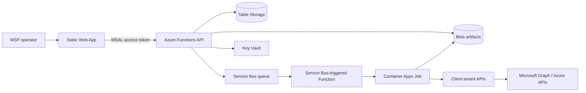

# MSP Automation Control Plane

A lightweight Azure control plane for running repeatable MSP automation modules across client environments.

The project is designed for MSP scenarios where useful automations exist, but each one usually needs its own credentials, tenant targeting, logging, approval process, and run history. This control plane standardises those platform concerns so new automations can be added as isolated snap-in modules.

The goal is to provide a portable, low-cost, API-driven platform where automation modules can be added without rebuilding the core application. Each module declares what it needs, accepts a standard job payload, runs in an isolated worker, and returns structured results that the control plane can audit and display.

This repository focuses on the control plane itself: deployment, API, orchestration, tenant/client registry, target scoping, identity/secret brokering, queueing, audit, and module registration. Business-specific automation modules can be built as separate projects that plug into the platform contract.

## What This Demonstrates

- Serverless-first Azure architecture with Terraform deployment.
- Central MSP-hosted management plane with explicit client tenant boundaries.
- Microsoft Entra protected operator UI and Function API.
- Queue-based orchestration using Service Bus.
- Container Apps Jobs for isolated snap-in automation execution.
- Table/Blob storage for durable state, audit history, and structured module output.
- Repeatable module contract that supports CI/CD-produced container images.
- A live cloud smoke test proving the full request-to-result path.

## Architecture



The control plane is hosted centrally in the MSP Azure environment. Client tenants are represented by `ClientConnection` records that describe tenant ID, execution identity, allowed modules, allowed scopes, permissions, and readiness state.

## Validated Flow

The current cloud smoke test validates this path:

```text
Authenticated operator
  -> Register/reuse client connection
  -> Register/reuse module manifest
  -> Submit job
  -> Queue dispatch message
  -> Start Container Apps Job
  -> Module writes structured output to Blob Storage
  -> API collects output
  -> Job marked Succeeded
```

The validated job lifecycle is:

```text
Queued -> Running -> Succeeded
```

For a deployment-safe API and registration check, run:

```powershell
.\scripts\test-cloud-smoke.ps1 -RegistrationOnly
```

For a real Container Apps execution, create ignored local smoke files under `.work`, replace the target tenant placeholders, then run the smoke test with explicit paths:

```powershell
.\scripts\new-full-execution-smoke-files.ps1

.\scripts\test-cloud-smoke.ps1 `
  -ClientConnectionPath ".work\smoke\client-connection-real.json" `
  -JobRequestPath ".work\smoke\submit-job-real.json"
```

## Problem Statement

MSPs often build useful automations, but they become hard to reuse because each script has its own setup, credentials, inputs, logging, and execution pattern. This project aims to standardise the surrounding platform:

- Register client tenants and execution contexts.
- Expose approved automation modules through a simple UI/API.
- Queue and run jobs reliably.
- Store run history, outputs, and audit events.
- Keep secrets in Key Vault rather than inside scripts or app settings.
- Allow modules to be replaced or extended without changing the control plane.
- Let module authors focus on business logic instead of rebuilding tenant pickers, approval flows, job tracking, secret handling, and audit logging.

## Product Boundary

This project should produce a reusable deployment package that others can configure for their own region, tenant, subscription, naming rules, and module sources.

The control plane provides:

- Deployable Azure infrastructure.
- API surface for tenants, modules, jobs, scopes, approvals, and results.
- Module registry and management interface for adding snap-ins.
- Standard app container registration contract.
- Standard job input and output contract.
- Shared operator interface.
- Shared security, audit, and observability.

The control plane does not provide every automation. Instead, it provides the platform that makes automations easy to snap in.

The primary deployment model is a central MSP-hosted control plane. Managed client tenants are connected through explicit client connection records that define the tenant ID, execution identity, enabled modules, allowed scopes, and permission readiness.

## Initial Direction

The control plane should be serverless-first, but not force every automation to run inside Azure Functions. Functions are a good fit for APIs, orchestration, validation, and short tasks. Container-based workers are a better fit for snap-ins because modules may need different SDKs, PowerShell modules, CLIs, or runtime versions.

Recommended MVP architecture:

- Frontend: Azure Static Web Apps or App Service.
- API: Azure Functions using .NET isolated worker.
- Queue: Azure Service Bus for job dispatch.
- Worker runtime: Azure Container Apps Jobs for snap-in modules.
- State: Azure Table Storage for the first version, with a clean repository layer so it can move to Cosmos DB or Azure SQL later.
- Secrets: Azure Key Vault.
- Identity: Managed identities for Azure resources, with per-client Microsoft Entra app registrations or federated identity where needed.
- Observability: Application Insights and Log Analytics.
- Infrastructure: Terraform.

Optional enterprise edge components such as API Management and Application Gateway should be deployment tiers, not MVP requirements.

## Runtime Decision

The controller layer will use an event-driven Azure Functions model rather than an always-on ASP.NET Core controller app.

In this model, the control plane is a set of focused functions:

- HTTP-triggered functions for operator/API requests.
- Service Bus-triggered functions for queued job dispatch.
- Timer-triggered functions for cleanup, stale job checks, and scheduled maintenance.
- Callback functions for snap-in job completion.

Functions wake up for a specific event, read and update shared platform state, call the required Azure service, then finish. Durable state lives in Table Storage, Blob Storage, Key Vault, and Service Bus rather than in a long-running process.

## Deployment Direction

Infrastructure will be deployed with Terraform and supported by PowerShell deployment scripts.

The intended flow is:

- Pre-discovery script for tenant, subscription, account, and region defaults.
- Optional bootstrap script for privileged setup.
- Deployment script for Terraform.
- Function App deployment script for the control API runtime.
- Post-deployment script for generated URLs and runtime settings.
- Optional teardown script for lab environments.

The first Terraform deployment target is the central MSP environment. Client tenants are registered later as `ClientConnection` records rather than receiving their own management plane deployment.

### Deployment Commands

Create an environment-specific `terraform.tfvars` file from the relevant example under `infra/environments/<environment>`, then run:

```powershell
.\scripts\deploy.ps1 -Environment "<environment>" -Apply -AutoApprove
.\scripts\ensure-swa-auth-app.ps1
.\scripts\deploy-function.ps1
.\scripts\deploy-frontend.ps1
.\scripts\post-deploy.ps1
```

For lab cleanup, preview teardown first:

```powershell
.\scripts\teardown.ps1 -Environment "<environment>"
```

Then destroy the Terraform-managed resources and the script-managed Static Web App/API auth app registration:

```powershell
.\scripts\teardown.ps1 -Environment "<environment>" -Destroy -AutoApprove
```

Use `-KeepAuthApp` if the Entra app registration is shared or manually managed outside this lab deployment.

If Container Apps is used for worker execution, the Azure subscription must have the `Microsoft.App` resource provider registered:

```powershell
az provider register --namespace Microsoft.App
```

The Static Web App hosts the static management UI. The UI uses MSAL to sign operators in against the MSP tenant and sends the resulting access token to the Function API. `ensure-swa-auth-app.ps1` exposes the API scope, ensures the matching Enterprise App/service principal exists, and configures the Function App to validate MSP-tenant bearer tokens. `deploy-frontend.ps1` injects the API base URL plus MSAL client settings into the Static Web App package. By default, API access is limited to the signed-in implementor's Entra user object ID; additional allowed user IDs or group IDs can be passed to `ensure-swa-auth-app.ps1`.

The first browser launch after enabling the API scope may require a one-time Microsoft Entra consent prompt. In production, an MSP can assign access through an operator group and pass that group object ID during bootstrap:

```powershell
.\scripts\ensure-swa-auth-app.ps1 -AllowedGroupIds "<operator-group-object-id>"
```

For lab or small MSP environments, the bootstrap script can also create or reuse a named operator group and add the signed-in implementor:

```powershell
.\scripts\ensure-swa-auth-app.ps1 -CreateOperatorGroup -OperatorGroupDisplayName "MSP Control Plane Operators" -AddSignedInUserToOperatorGroup
```

## Core Concepts

Client tenant:
Represents a managed customer or internal environment. Stores non-secret metadata such as tenant ID, display name, default region, and enabled modules.

Automation module:
A reusable snap-in that declares its metadata, required permissions, parameters, image, timeout, and output schema.

Target scope:
The object set a job runs against. A module can support tenant-wide execution, selected users, multiple users, groups, devices, subscriptions, resource groups, or custom object lists.

Job:
A requested execution of a module against a client tenant. Jobs are submitted through the API, queued, executed by a worker, and recorded in run history.

Run output:
Structured result returned by the module. Outputs should include status, summary, findings, metrics, and artifact references.

Derived artifact:
Optional downstream output created from a stored job artifact by a data consumer connector. The raw module artifact remains the source of truth; derived artifacts are for summaries, exports, AI-assisted interpretation, dashboards, or notification-specific payloads.

Approval:
Optional workflow step for high-risk modules. Some modules may run immediately; others may require approval before execution.

## Design Principles

- The control plane owns scheduling, state, security, audit, and visibility.
- Snap-ins own their specific automation logic.
- Snap-ins communicate through a versioned contract, not bespoke control plane APIs.
- Snap-ins bring business logic; the control plane provides common platform services.
- Secrets are referenced, not embedded in job payloads.
- Target scope is first-class in every job request.
- Long-running or dependency-heavy work runs in containers, not HTTP request handlers.
- Tenant boundaries should be explicit and visible in every job request.
- The first version should be simple enough to deploy, demo, and reason about.

## Candidate First Snap-Ins

Good first modules:

- Health check module that validates the job contract and returns basic environment details.
- Azure cost and governance report for a small business or MSP client.
- Microsoft 365 license usage report.
- Defender and policy baseline report.

The health check module should come first because it proves the control plane can register a module, submit a job, run a container, collect output, and display history before any real business logic is added.

Next planned business-value module:

- MSP account-management report covering tenant overview, license usage, unused licenses, cost indicators, and notable governance findings.

That module is intentionally separate from the control plane. It should plug into the same manifest, readiness, job, and output contract.

## Demo Walkthrough

Recommended demo path:

1. Open the protected management UI and complete Microsoft Entra sign-in.
2. Review the client connection and readiness state.
3. Review the registered `tenant-health-check` module manifest.
4. Compose a job using the guided job form.
5. Run readiness check before submission.
6. Submit the job and observe it move from `Queued` to `Running`.
7. Collect the result and review structured output.
8. Open Data Consumers, process the raw result artifact, and inspect the derived JSON.
9. Open audit history to show who requested the job and when.

For a portfolio README, short GIFs work well for the UI flow. A separate 3-5 minute screen recording can explain the MSP business problem, architecture, security model, and validated job lifecycle.

## Cost And Security Notes

The MVP is intentionally low-idle-cost:

- Azure Functions runs the API and event handlers.
- Static Web Apps hosts the frontend.
- Service Bus decouples job submission from execution.
- Container Apps Jobs run only when a module job starts.
- Table Storage and Blob Storage provide inexpensive durable state and artifacts.

Security boundaries:

- Operators authenticate through Microsoft Entra in the browser using MSAL.
- API calls require bearer tokens for the configured API scope.
- Operator access can be limited by user object ID, group object ID, or app role.
- Client tenant execution is represented by explicit non-secret connection records.
- Secrets and certificates are referenced through Key Vault locations, not embedded in job payloads.
- Readiness checks block jobs when a client is disabled, missing permissions, missing admin consent, not ready, or not allowed to run the selected module/scope.

## Repository Status

This repository now has a deployable MVP foundation:

- .NET 8 isolated Azure Functions control API.
- HTTP functions for health, modules, client connections, notification subscriptions, jobs, and audit.
- Recent job catalog and job event history in the management UI.
- Data consumer connector registration and derived artifact inspection in the management UI.
- Service Bus-triggered simulated dispatch flow.
- Container Apps Job execution provider for isolated module workers.
- Table Storage persistence provider.
- Terraform deployment for the central MSP control plane.
- Static management UI hosted on Azure Static Web Apps.
- Microsoft Entra protected management UI and Function API bearer-token validation.
- PowerShell scripts for pre-discovery, Terraform deployment, Function App zip deployment, Static Web App deployment, and post-deployment outputs.
- Client connection bootstrap helper for target tenant app registration metadata.
- Dual module intake model: manual manifest registration and CI/CD-produced module artifacts.

The first live deployment has validated health checks and an end-to-end job flow through Azure Functions, Table Storage, Service Bus, Container Apps Jobs, Blob artifact handoff, and result collection.

The current cloud smoke test validates the protected API, module import, client connection registration, Service Bus dispatch, Container Apps Job execution, blob result handoff, and result collection path. See [Cloud smoke test](docs/cloud-smoke-test.md).

## Further Reading

- [Architecture](docs/architecture.md)
- [Deployment model](docs/deployment-model.md)
- [Module contract](docs/module-contract.md)
- [Module CI/CD model](docs/module-ci-cd.md)
- [Cloud smoke test](docs/cloud-smoke-test.md)
- [Demo guide](docs/demo-guide.md)
- [Architecture risk register](docs/risk-register.md)
